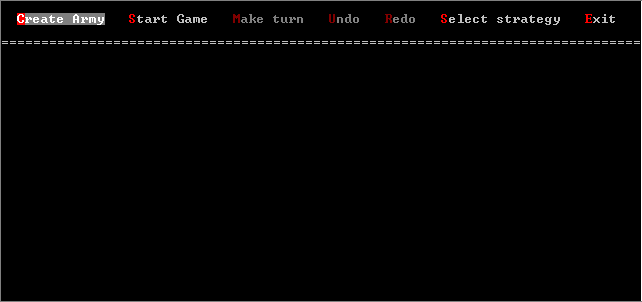
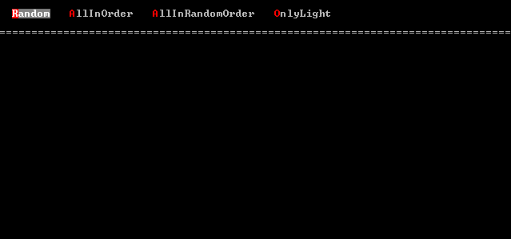
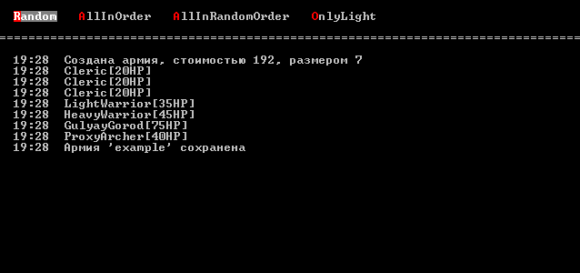
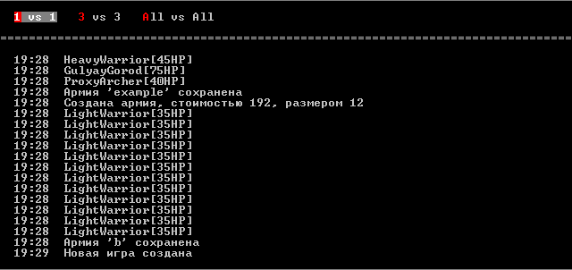
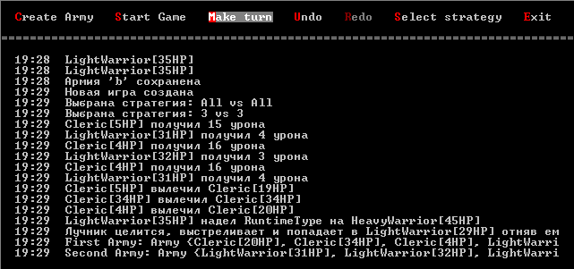
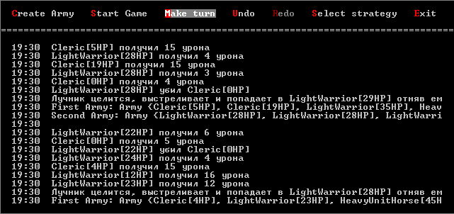
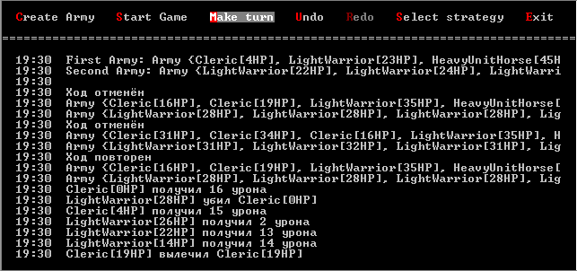

# StackArmiesGame

Учебный проект "Стековые войны"

## Цель

Изучение паттернов проектирование и применение их в проекте

## Задача

Реализовать игру "Стековые войны"

Две армии выстраиваются в виде стека друг напротив друга

Ближайшие юниты бьют друг друга, выбирая случайным образом кто бьёт первый

Затем в обоих армиях юниты облаюащие особыми способностями (интерфейс IAbility) выполняют свои действия

## Юниты

* LightWarrior - Лёгкий воин (способен одевать тяжёлого)
* HeavyWarrior - Тяжёлый воин (может быть экипирован)
* Archer - Лучник (стреляет в некотором радиусе)
* Cleric - Жрец (лечит союзников)
* Wizard - Волшебник (может клонировать союзников)
* GulyayGorod - ГуляйГород (штоето) (не может атаковать, представляет из себя стену с большим количество жизни и с большой защитой)

## Применяемые паттерны проектирования
### Порождающие паттерны
* Фабричный метод (Factory Method) - Создание Юнита - UnitFactory.cs
* Одиночка (Singleton) - Движок - Engine.cs
* Прототип (Prototype) - Клонирование юнитов магом - IClonable, некоторые юниты
### Паттерны поведения
* Стратегия (Strategy) - Изменение стратегии ведения боя - Engine.cs Strategy.cs
* Наблюдатель (Observer) - Наблюдение за смертью юнитов - IObservable.cs Observers.cs AUnit.cs
* Команда (Command) - Отмена и повтор хода - Engine.cs Command.cs
### Структурные паттерны
* Декоратор (Decorator) - Улучшение HeavyWarrior - HeavyUnitAttachments.cs
* Адаптер (Adapter) - Использование GulyayGorod из сторонней библиотеки, приведение к нужному интерфейсу - GulyayGorod.cs
* Заместитель (Proxy) - Логирование всех действий связанных с лучником - ProxyArcher.cs

## Скриншоты

Главное меню:

Создание армии:

Армия создана:

Выбор стратегии:

Примеры ходов:

Пример работы отмены и повтора хода:

